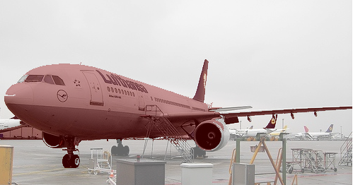
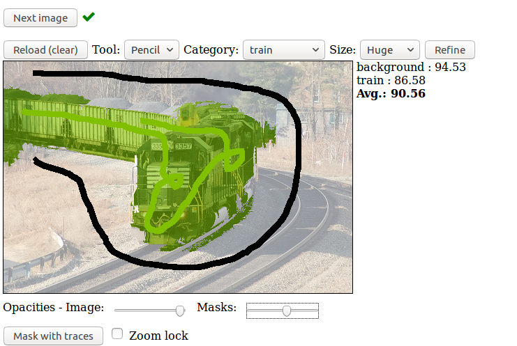

# COVISS-Lab-Research
Computer Vision and Sensing Systems Lab
http://coviss.org/

# Projects
Part I. Real-time Fruit Flower Detection using a Cloud-based Architecture    
Part II. Django to let user draw the outline of image, after our image processing, show the objects and confidence    

# Main Theories   
Part I.   
1.Thresholding the image into confidence foreground and background, uncertainty region; 2.Monte Carlo sampling of initial seeds; 3.Region Growing; 4.Majority voting and final classification   

Part II.  
Django as model-view-template architectural pattern, use python, HTML, CSS, JavaScript to get web interface working with public.    
Free hand drawing is most important one.   
We used ajax to refresh our image.   

# OpenCV with python
Basic steps for what we did for image process

# interface  
- Display an image in a web page  
- Freehand drawing over this image  
- Send the freehand traces to a server running the image processing algorithm (OpenCV or MATLAB)  
- Get back from the server a processed image.  
- Also get back the confidence of our result.   

# Draft results
tools and confidence    
    
 

result image   
    

# Draft Result 2   
Tools and result   
   
