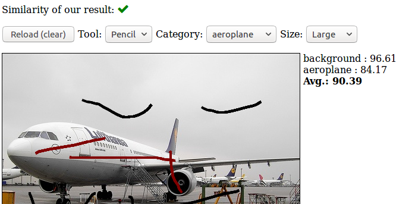

# COVISS-Lab-Research
Computer Vision and Sensing Systems Lab
http://coviss.org/

# Project   
FreeLabel: A Publicly Available Annotation Tool based on Freehand Traces   
Part I. Real-time Fruit Flower Detection using a Cloud-based Architecture (semi-supervised learning)      
Part II. Django to let user draw the outline of image, after our image processing, show the objects and confidence  (annotation tools)   
Our FreeLabel tool for segmentation annotation relies on three main building blocks: a graphical user interface (GUI), the Django framework \cite{DjangoPython}, and the Region Growing Refinement (RGR) algorithm.      
Published paper is here: https://arxiv.org/abs/1902.06806   

# Goals    
No need for hand-writing labeling in huge dataset which is time-consumption and costs a lot. Within our project, we can label a lot of images with several traces.   
The goal of our project is developing FreeLabel, an intuitive open-source web interface that allows users to obtain high-quality segmentation masks with just a few freehand scribbles, in a matter of seconds.    

# Main Theories   
Part I.   
1.Thresholding the image into confidence foreground and background, uncertainty region; 2.Monte Carlo sampling of initial seeds; 3.Region Growing; 4.Majority voting and final classification   

Part II.  
Django as model-view-template architectural pattern, use python, HTML, CSS, JavaScript to get web interface working with public.    
Free hand drawing is most important one.   
We used ajax to refresh our image.   

# OpenCV with python
Basic steps for what we did for image process

# interface  
- Display an image in a web page  
- Freehand drawing over this image  
- Send the freehand traces to a server running the image processing algorithm (OpenCV or MATLAB)  
- Get back from the server a processed image.  
- Also get back the confidence of our result.   

# Draft results
tools and confidence    
    
 

result image   
    

# Draft Result 2   
Tools and result   
   

# Draft Result 3   
Tools and abstract     
   

result image      
  

# Draft Result 4    
 

